# Component Architecture

This document provides detailed information about each major component in Project AIRI's architecture.

## Component Overview

Project AIRI consists of multiple interconnected components organized in different layers. Each component has specific responsibilities and well-defined interfaces.

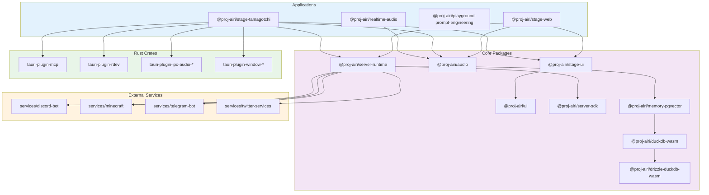

## Application Components

### Stage Web (`@proj-airi/stage-web`)
Browser-based frontend application providing the main AIRI interface.

**Technologies**: Vue 3, TypeScript, Vite, UnoCSS
**Key Features**:
- Real-time character interaction
- WebGPU-accelerated rendering
- Progressive Web App support
- Cross-browser compatibility

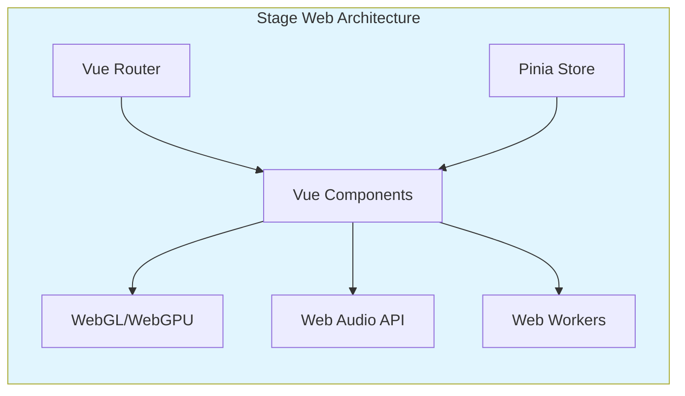

### Stage Tamagotchi (`@proj-airi/stage-tamagotchi`)
Desktop application built with Tauri, providing native OS integration.

**Technologies**: Tauri, Rust, Vue 3, Native APIs
**Key Features**:
- Native desktop integration
- Hardware acceleration
- Local file system access
- System-level audio/video processing

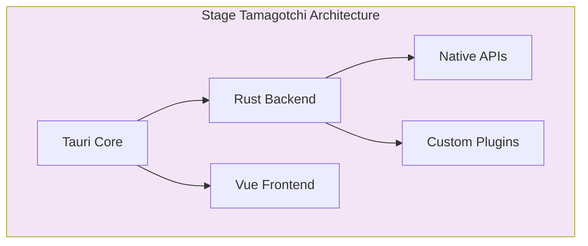

## Core Package Components

### Stage UI (`@proj-airi/stage-ui`)
Comprehensive UI component library specifically designed for AIRI's interface.

**Key Components**:
- Character display and animation
- Chat interfaces
- Settings panels
- Loading screens
- Transition effects

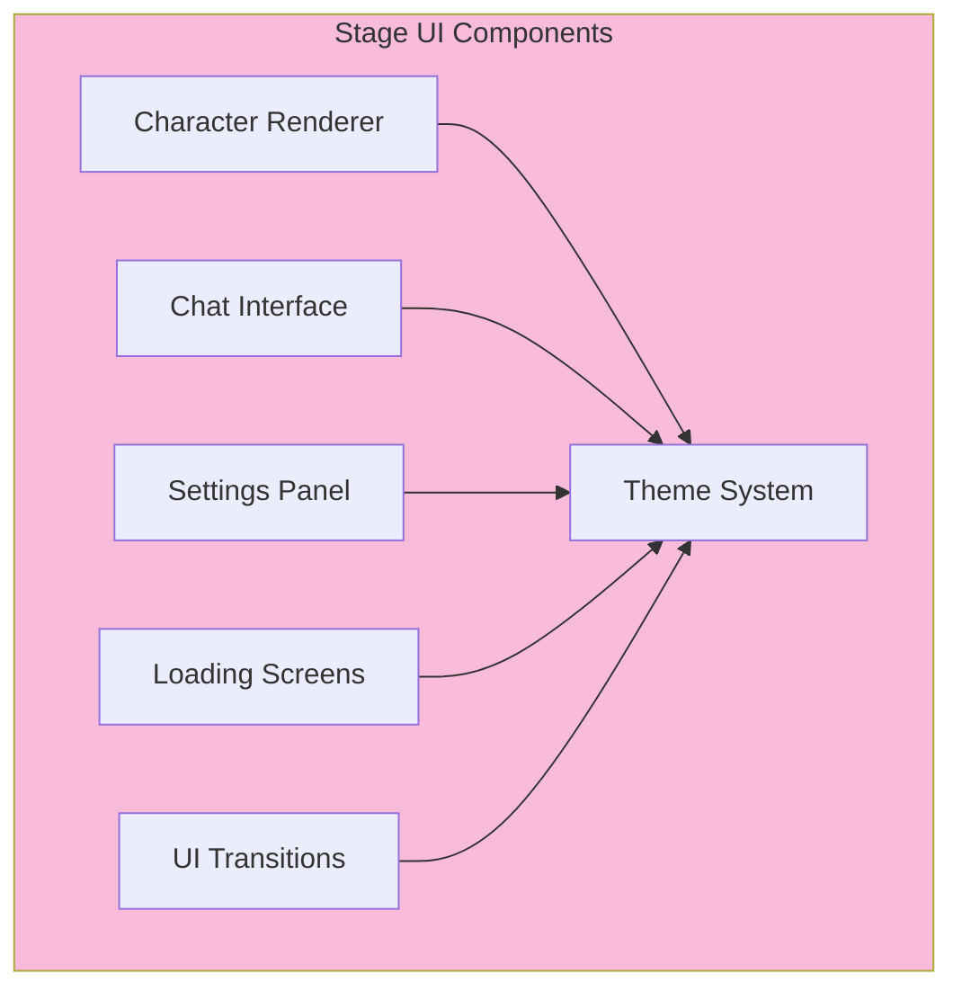

### Audio System (`@proj-airi/audio`)
Comprehensive audio processing pipeline for real-time voice interaction.

**Key Features**:
- Voice Activity Detection (VAD)
- Speech Recognition (STT)
- Text-to-Speech (TTS)
- Audio streaming and effects
- Real-time processing

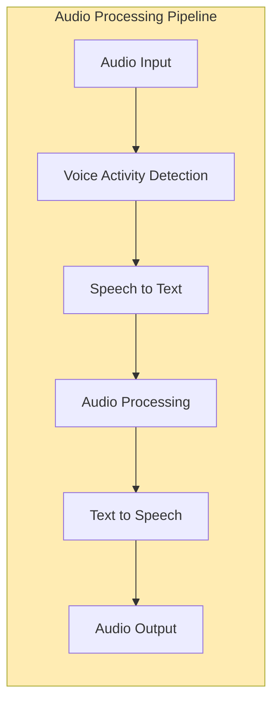

### Server Runtime (`@proj-airi/server-runtime`)
Core server-side runtime managing AIRI's behavior and state.

**Responsibilities**:
- Character state management
- Service coordination
- Real-time decision making
- Memory management
- External service integration

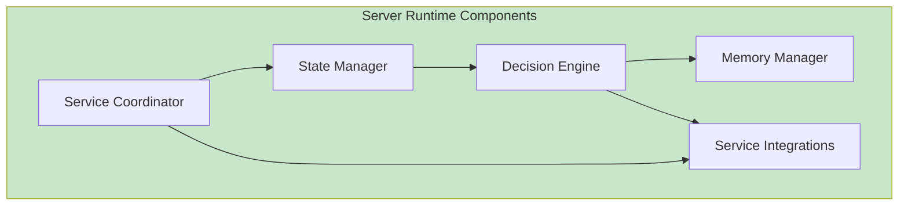

### Memory System (`@proj-airi/memory-pgvector`)
Advanced memory management system for persistent character memory.

**Features**:
- Vector-based semantic search
- Episodic memory storage
- Context-aware retrieval
- Memory consolidation
- Privacy-preserving storage

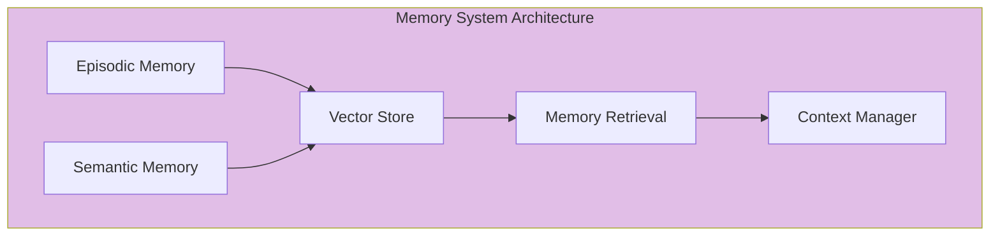

### Database Layer (`@proj-airi/duckdb-wasm` & `@proj-airi/drizzle-duckdb-wasm`)
High-performance embedded database system running in WebAssembly.

**Key Features**:
- In-browser SQL analytics
- Type-safe database operations
- High-performance queries
- Zero-config embedded database
- Cross-platform compatibility

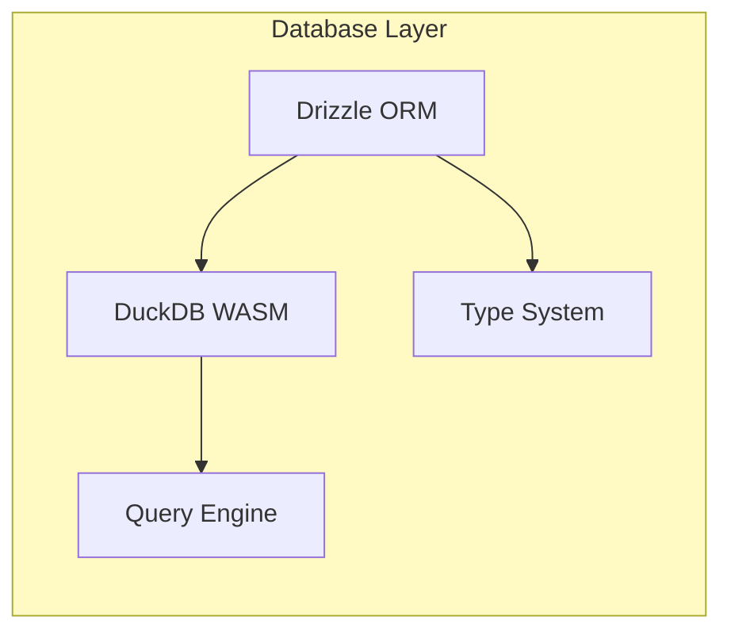

## Service Components

### Discord Bot Service
Comprehensive Discord integration providing voice and text interaction.

**Key Features**:
- Voice channel participation
- Slash command support
- Message handling
- Audio streaming
- User interaction tracking

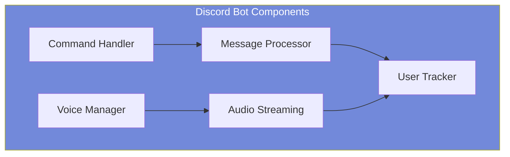

### Minecraft Service
Intelligent Minecraft gameplay automation and interaction.

**Technologies**: Mineflayer, JavaScript, Minecraft Protocol
**Key Features**:
- Autonomous gameplay
- Chat interaction
- World exploration
- Task execution
- Player collaboration

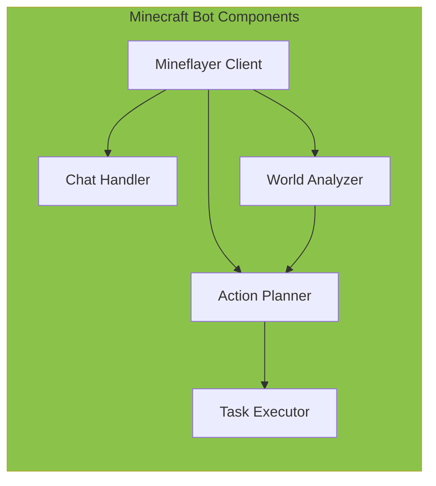

### Factorio Service
Advanced Factorio automation and base management.

**Technologies**: Factorio RCON, TypeScript, Autorio library
**Key Features**:
- Factory automation
- Resource management
- Base planning
- Production optimization
- Real-time monitoring

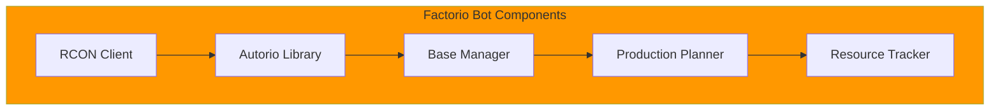

## Tauri Plugin Components

### MCP Plugin (`tauri-plugin-mcp`)
Model Context Protocol integration for AI model management.

**Features**:
- Model lifecycle management
- Context sharing
- Plugin communication
- Resource management

### Audio Plugins (`tauri-plugin-ipc-audio-*`)
Native audio processing plugins for desktop application.

**Components**:
- `tauri-plugin-ipc-audio-transcription-ort`: Speech recognition
- `tauri-plugin-ipc-audio-vad-ort`: Voice activity detection

### Window Management Plugins
Advanced window behavior and interaction plugins.

**Components**:
- `tauri-plugin-window-pass-through-on-hover`: Transparent window interaction
- `tauri-plugin-window-router-link`: Router integration
- `tauri-plugin-rdev`: Input device monitoring

## Component Communication

### Inter-Component Communication Patterns

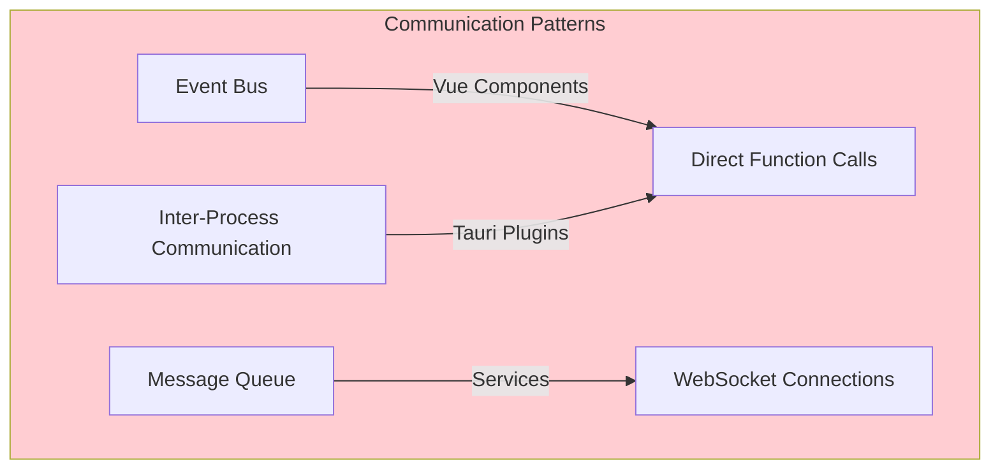

### Data Flow Between Components

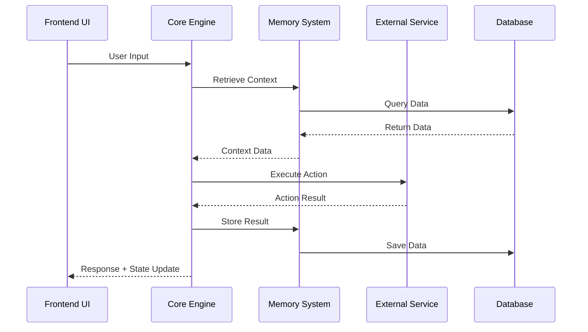

## Component Dependencies

### Dependency Graph

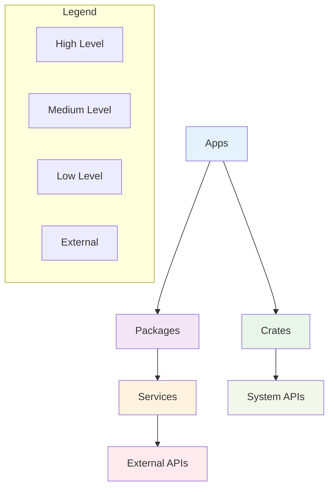

This component architecture ensures modularity, testability, and maintainability while providing the flexibility needed for AIRI's complex requirements.