# Data Architecture

This document details the data architecture, flow, storage systems, and management strategies used in Project AIRI.

## Data Architecture Overview

Project AIRI employs a sophisticated data architecture designed to handle real-time interactions, persistent memory, and complex AI processing workflows.

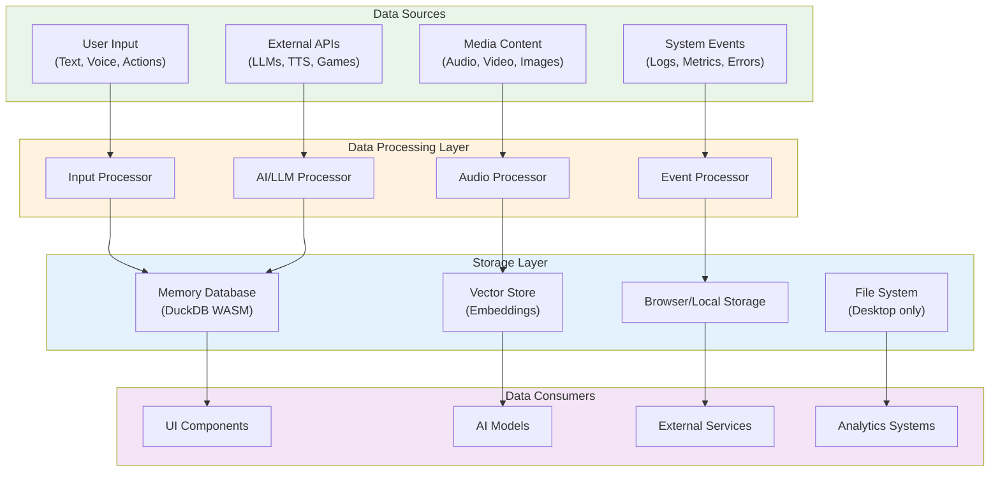

## Data Models

### Core Data Entities

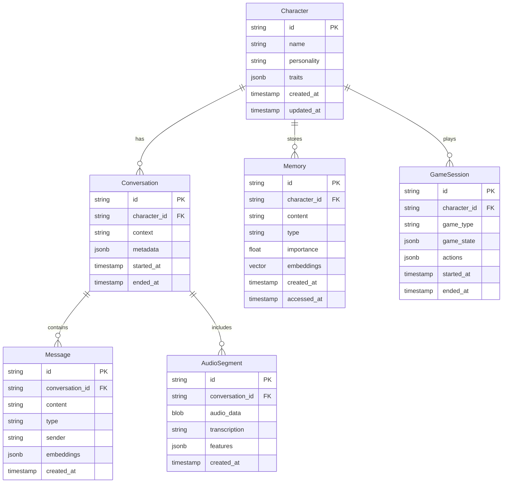

### Memory System Data Model

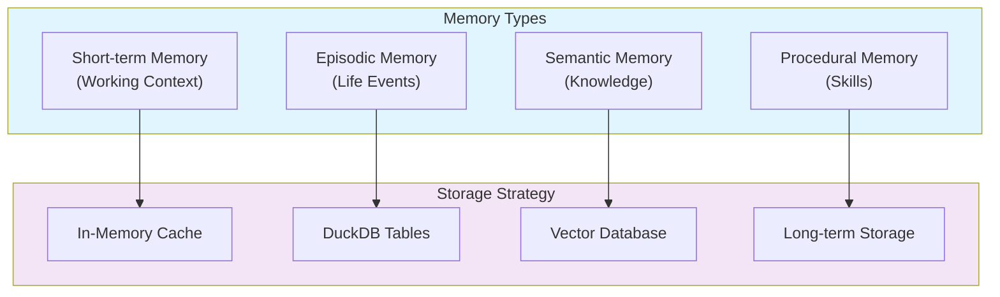

## Data Flow Architecture

### Real-time Data Flow

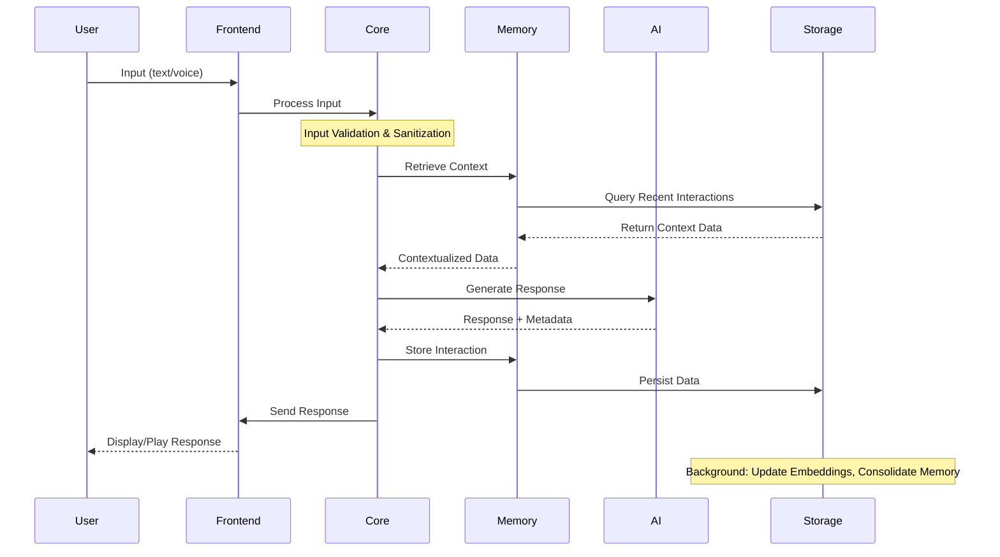

### Audio Data Processing Flow

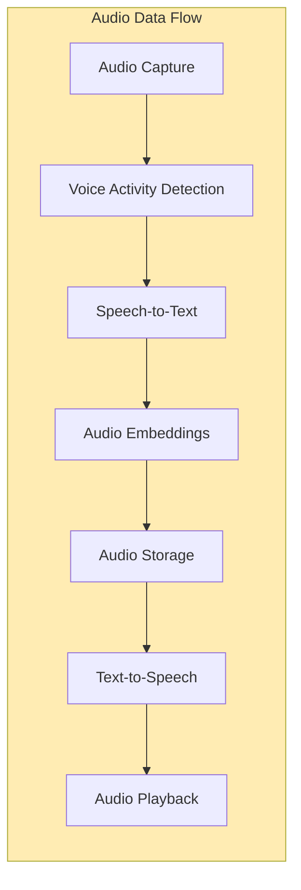

### Game Data Integration Flow

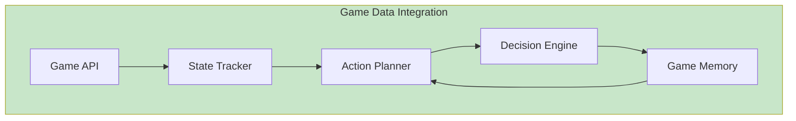

## Storage Systems

### DuckDB WASM Database

**Primary Use Cases**:
- Structured data storage
- Complex analytical queries
- Time-series data analysis
- Conversation history

**Schema Design**:
```sql
-- Conversations table
CREATE TABLE conversations (
    id VARCHAR PRIMARY KEY,
    character_id VARCHAR NOT NULL,
    context TEXT,
    metadata JSON,
    started_at TIMESTAMP,
    ended_at TIMESTAMP,
    created_at TIMESTAMP DEFAULT NOW()
);

-- Messages table  
CREATE TABLE messages (
    id VARCHAR PRIMARY KEY,
    conversation_id VARCHAR REFERENCES conversations(id),
    content TEXT NOT NULL,
    message_type VARCHAR NOT NULL,
    sender VARCHAR NOT NULL,
    embeddings FLOAT[],
    created_at TIMESTAMP DEFAULT NOW()
);

-- Memory table
CREATE TABLE memories (
    id VARCHAR PRIMARY KEY,
    character_id VARCHAR NOT NULL,
    content TEXT NOT NULL,
    memory_type VARCHAR NOT NULL,
    importance FLOAT DEFAULT 0.5,
    embeddings FLOAT[],
    created_at TIMESTAMP DEFAULT NOW(),
    accessed_at TIMESTAMP DEFAULT NOW()
);
```

### Vector Storage System

**Implementation**: Custom vector store with similarity search capabilities

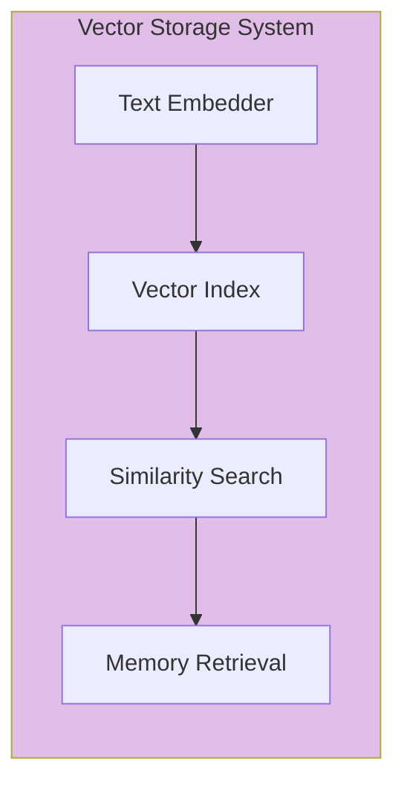

**Key Features**:
- Semantic similarity search
- Efficient vector indexing
- Real-time embedding generation
- Memory consolidation algorithms

### Local Storage Strategy

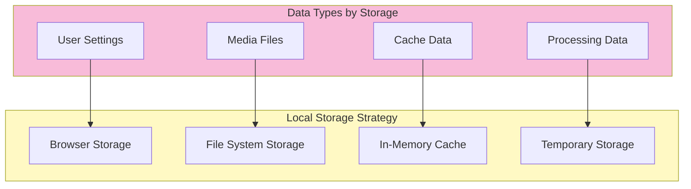

## Data Processing Pipelines

### Input Processing Pipeline

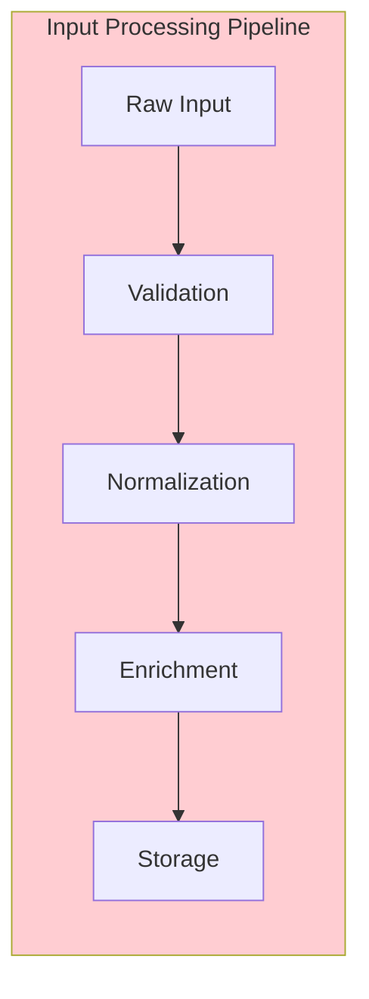

**Processing Steps**:
1. **Validation**: Input sanitization and format validation
2. **Normalization**: Text normalization, encoding standardization
3. **Enrichment**: Context addition, metadata extraction
4. **Storage**: Persistent storage with indexing

### Memory Consolidation Pipeline

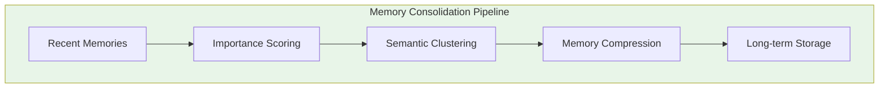

**Consolidation Process**:
- **Importance Scoring**: Relevance and emotional weight calculation
- **Semantic Clustering**: Grouping related memories
- **Compression**: Redundant information removal
- **Long-term Storage**: Persistent memory formation

## Data Privacy and Security

### Privacy-First Design

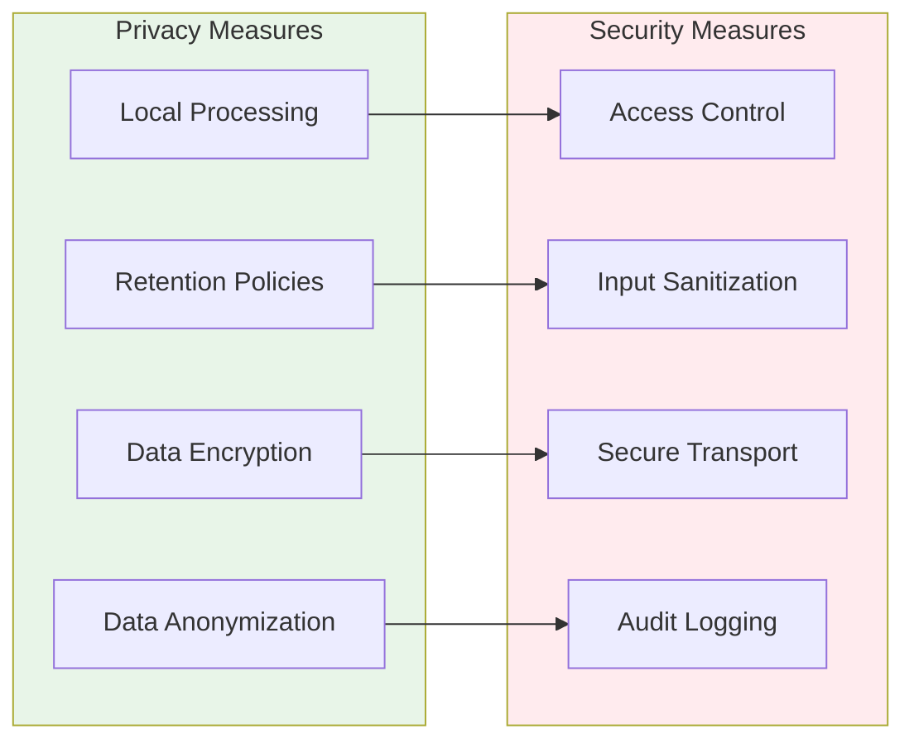

### Data Encryption Strategy

**Encryption at Rest**:
- Local database encryption
- Sensitive data field-level encryption
- Key derivation from user credentials

**Encryption in Transit**:
- HTTPS/WSS for all communications
- End-to-end encryption for sensitive data
- Certificate pinning for API connections

## Performance Optimization

### Data Access Patterns

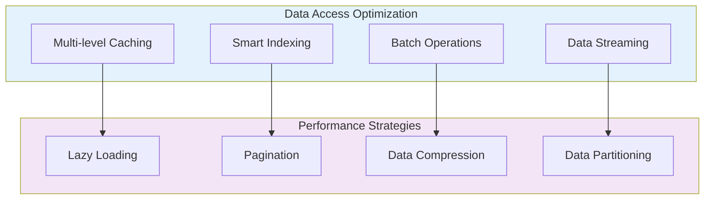

### Memory Management

**Memory Usage Optimization**:
- Automatic garbage collection
- Memory-mapped file access
- Efficient data structures
- Resource pooling

**Performance Metrics**:
- Query execution time
- Memory usage patterns
- Cache hit rates
- Storage I/O operations

## Data Migration and Versioning

### Schema Evolution

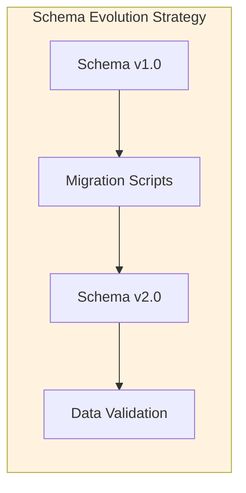

**Migration Strategy**:
- Forward-compatible schema changes
- Automated migration scripts
- Data integrity validation
- Rollback capabilities

## Analytics and Monitoring

### Data Analytics Pipeline

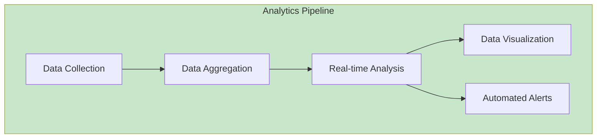

**Monitoring Metrics**:
- System performance metrics
- User interaction patterns
- Memory usage analytics
- Error tracking and analysis

This data architecture ensures efficient, secure, and scalable data management while maintaining privacy and providing real-time performance for AIRI's complex AI interactions.