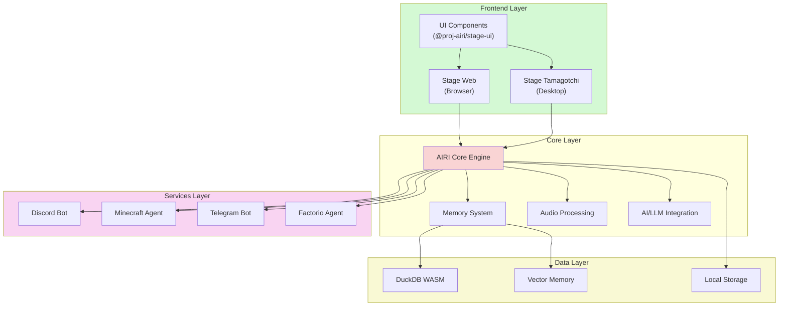

# Technical Architecture

This section provides comprehensive technical architecture documentation for Project AIRI, covering all aspects of the system design, components, and their interactions.

## Architecture Overview

Project AIRI is a sophisticated AI VTuber platform built with modern web technologies and capable of running both in browsers and as desktop applications. The architecture is designed to be modular, scalable, and extensible.

## Architecture Sections

- [System Overview](./system-overview) - High-level system architecture and main components
- [Component Architecture](./component-architecture) - Detailed breakdown of each major component
- [Data Architecture](./data-architecture) - Data flow, storage, and management systems
- [Integration Architecture](./integration-architecture) - External service integrations and APIs
- [Technology Stack](./technology-stack) - Detailed breakdown of technologies used
- [Deployment Architecture](./deployment-architecture) - Different deployment scenarios and configurations

## Key Architectural Principles

1. **Web-First Design**: Built with Web technologies (WebGPU, WebAudio, WebAssembly) for maximum compatibility
2. **Modular Architecture**: Loosely coupled components that can be developed and deployed independently
3. **Multi-Platform Support**: Runs in browsers (Stage Web) and as desktop applications (Stage Tamagotchi)
4. **Extensibility**: Plugin system for adding new capabilities and integrations
5. **Performance**: Optimized for real-time audio/video processing and AI inference
6. **Scalability**: Designed to handle multiple concurrent users and integrations

## Quick Architecture Reference

Navigate to specific sections above for detailed architectural documentation.