# Integration Architecture

This document details how Project AIRI integrates with external services, APIs, and platforms to provide comprehensive AI VTuber functionality.

## Integration Overview

Project AIRI is designed as an open, extensible platform that integrates with numerous external services to enhance AIRI's capabilities across different domains.

```mermaid
%%{ init: { 'flowchart': { 'curve': 'catmullRom' } } }%%

graph TB
    subgraph Core["AIRI Core"]
        Engine["AIRI Engine"]
        ServiceBridge["Service Bridge"]
        APIGateway["API Gateway"]
    end
    
    subgraph AIServices["AI & ML Services"]
        LLMProviders["LLM Providers<br/>(40+ supported)"]
        TTSServices["TTS Services<br/>(ElevenLabs, etc.)"]
        STTServices["STT Services<br/>(Local & Cloud)"]
        ModelRepos["Model Repositories<br/>(HuggingFace)"]
    end
    
    subgraph Gaming["Gaming Platforms"]
        Minecraft["Minecraft Servers"]
        Factorio["Factorio Servers"]
        GameAPIs["Game APIs"]
    end
    
    subgraph Social["Social Platforms"]
        Discord["Discord"]
        Telegram["Telegram"]
        Twitter["Twitter/X"]
        CustomPlatforms["Custom Platforms"]
    end
    
    subgraph Infrastructure["Infrastructure"]
        CloudServices["Cloud Services"]
        CDNs["Content Delivery Networks"]
        Analytics["Analytics Services"]
        Monitoring["Monitoring Tools"]
    end
    
    Engine --> ServiceBridge
    ServiceBridge --> APIGateway
    
    APIGateway --> LLMProviders
    APIGateway --> TTSServices
    APIGateway --> STTServices
    APIGateway --> ModelRepos
    
    APIGateway --> Minecraft
    APIGateway --> Factorio
    APIGateway --> GameAPIs
    
    APIGateway --> Discord
    APIGateway --> Telegram
    APIGateway --> Twitter
    APIGateway --> CustomPlatforms
    
    APIGateway --> CloudServices
    APIGateway --> CDNs
    APIGateway --> Analytics
    APIGateway --> Monitoring
    
    style Core fill:#ff6b6b
    style AIServices fill:#4ecdc4
    style Gaming fill:#45b7d1
    style Social fill:#f9ca24
    style Infrastructure fill:#6c5ce7
```

## AI and ML Service Integrations

### LLM Provider Integration

Project AIRI supports 40+ LLM providers through the unified xsAI library, providing seamless switching between different AI models.

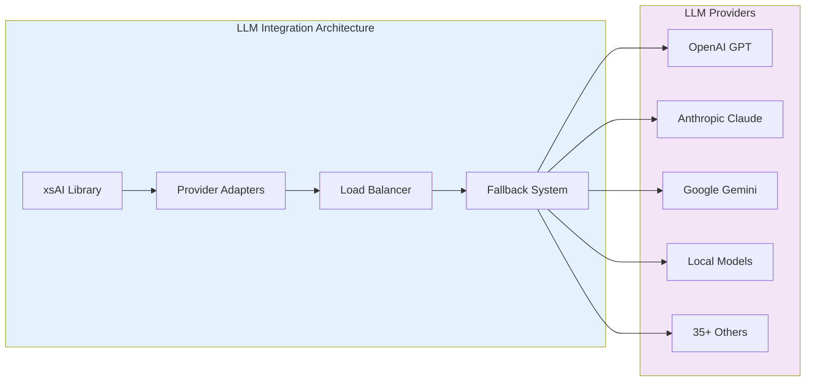

**Supported LLM Providers**:
- **OpenAI**: GPT-4, GPT-4 Turbo, GPT-3.5
- **Anthropic**: Claude 3.5 Sonnet, Claude 3 Haiku
- **Google**: Gemini 1.5 Pro, Gemini Flash
- **Local Models**: Ollama, vLLM, SGLang
- **Cloud Providers**: OpenRouter, Groq, Together.ai
- **Specialized**: DeepSeek, Qwen, xAI Grok, Mistral
- **Regional**: Zhipu, SiliconFlow, Moonshot AI, Baichuan

### Voice Services Integration

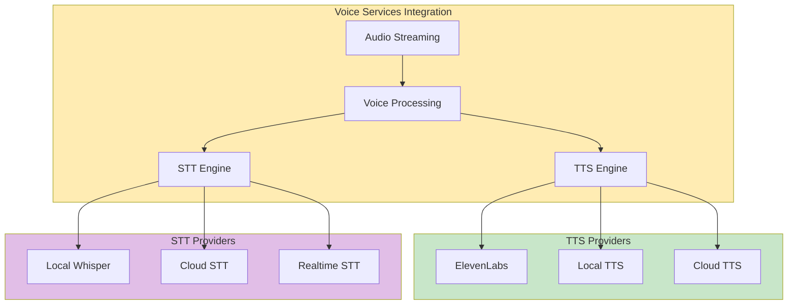

### Model Repository Integration

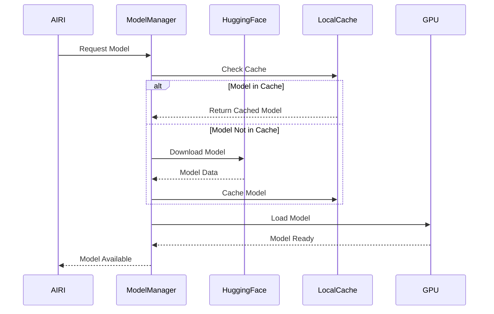

## Gaming Platform Integrations

### Minecraft Integration

Advanced Minecraft bot integration using Mineflayer for autonomous gameplay and interaction.

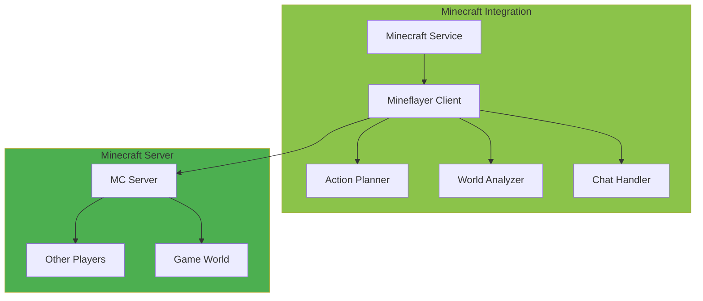

**Minecraft Capabilities**:
- Autonomous movement and navigation
- Resource gathering and crafting
- Building and construction
- Player interaction and chat
- Quest completion and exploration

### Factorio Integration

Sophisticated Factorio automation through RCON API and custom mod integration.

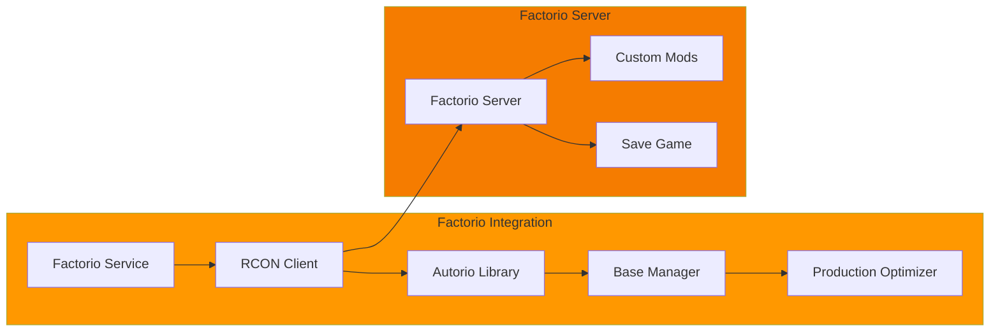

**Factorio Capabilities**:
- Factory design and construction
- Production chain optimization
- Resource management
- Research progression
- Multiplayer coordination

## Social Platform Integrations

### Discord Integration

Comprehensive Discord bot with voice channel support and advanced interaction capabilities.

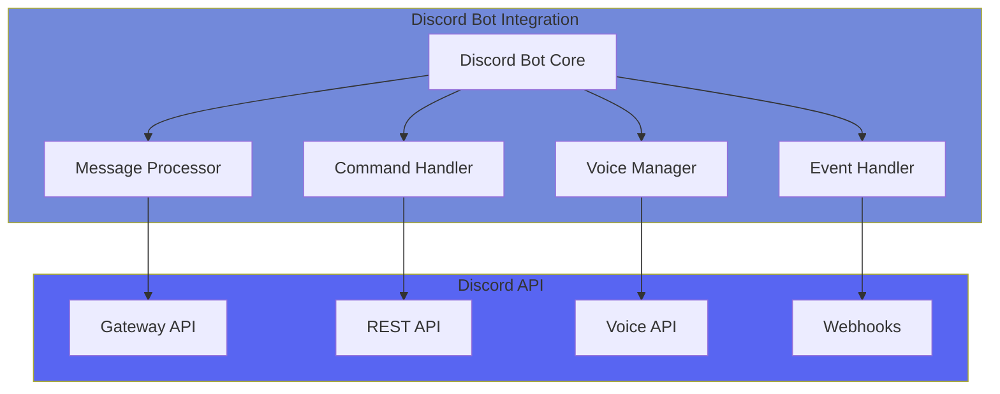

**Discord Features**:
- Slash command support
- Voice channel participation
- Real-time audio streaming
- Message interaction handling
- Server event monitoring

### Telegram Integration

Telegram bot integration for text and media interaction.

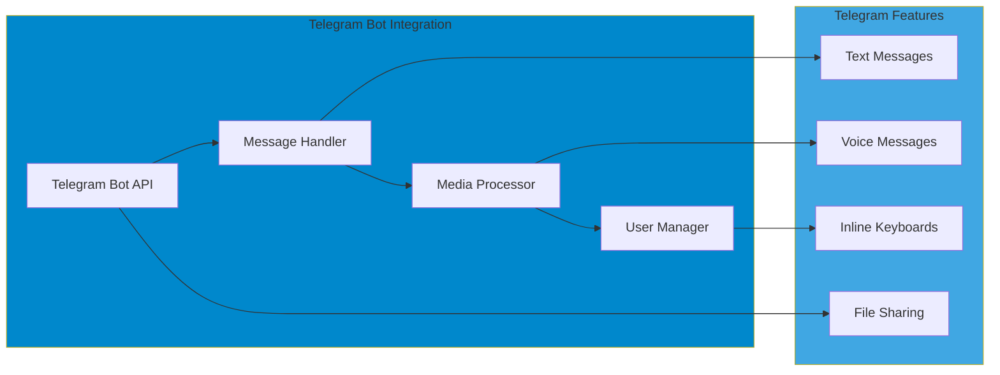

### Twitter/X Integration

Social media integration for content sharing and interaction monitoring.

```mermaid
graph TB
    subgraph TwitterIntegration["Twitter/X Integration"]
        TwitterService["Twitter Service"]
        ContentManager["Content Manager"]
        InteractionTracker["Interaction Tracker"]
        ScheduleManager["Schedule Manager"]
    end
    
    subgraph TwitterAPI["Twitter API"]
        v2API["Twitter API v2"]
        Streaming["Streaming API"]
        Media["Media API"]
        DM["Direct Messages"]
    end
    
    TwitterService --> ContentManager
    ContentManager --> InteractionTracker
    InteractionTracker --> ScheduleManager
    
    ContentManager --> v2API
    InteractionTracker --> Streaming
    ContentManager --> Media
    ScheduleManager --> DM
    
    style TwitterIntegration fill:#1da1f2
    style TwitterAPI fill:#14171a
```

## Integration Patterns

### Service Integration Architecture

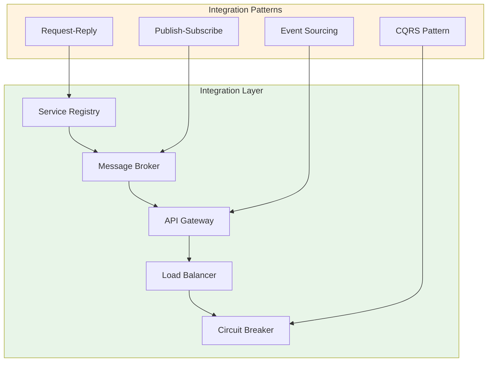

### Error Handling and Resilience

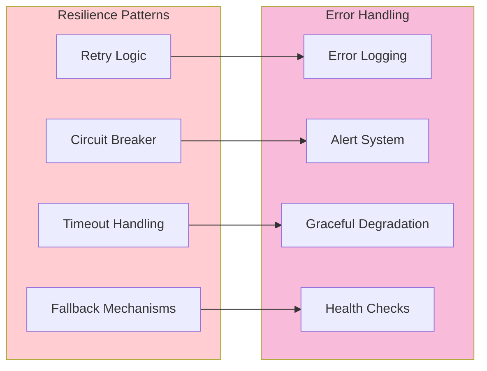

## API Design and Standards

### RESTful API Design

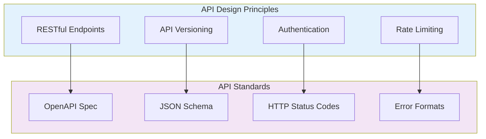

### WebSocket Integration

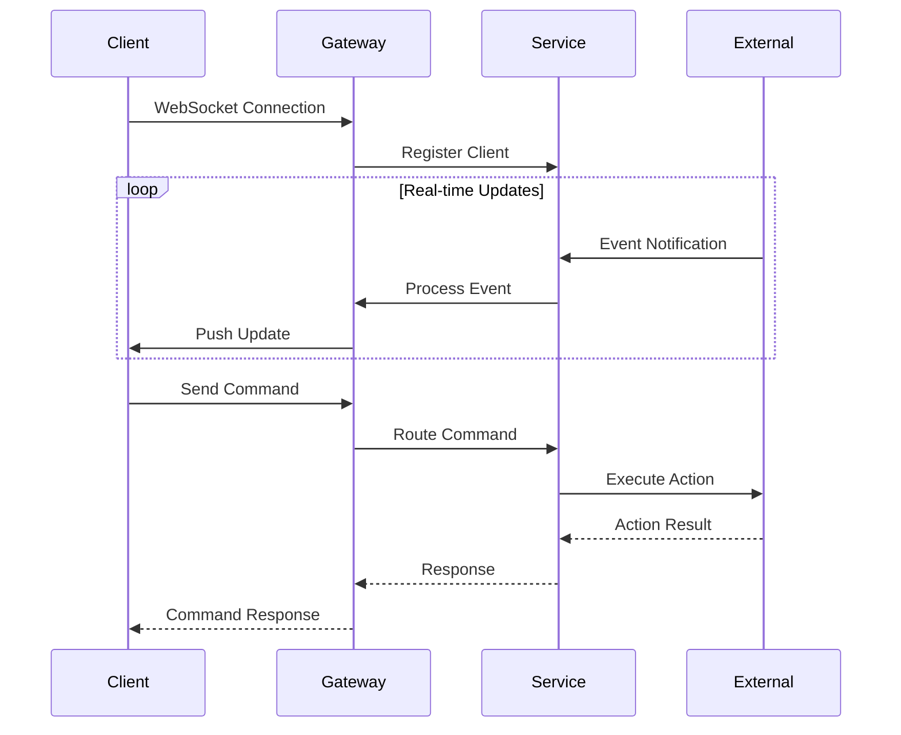

## Security and Compliance

### Security Integration

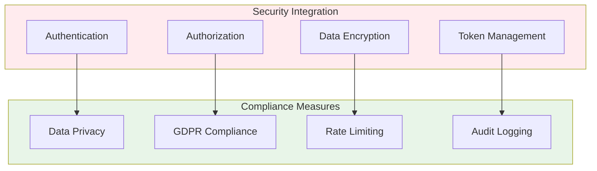

### API Security

**Security Measures**:
- OAuth 2.0 / JWT authentication
- API key management and rotation
- Request signing and verification
- HTTPS/TLS encryption
- Input validation and sanitization
- Rate limiting and abuse prevention

## Monitoring and Observability

### Integration Monitoring

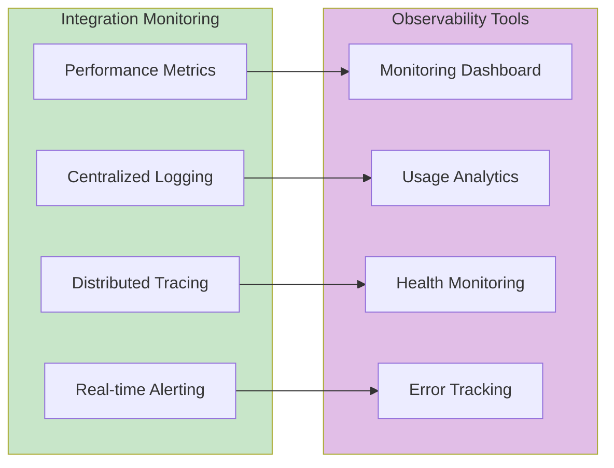

### Performance Monitoring

**Key Metrics**:
- API response times
- Integration success/failure rates
- Resource utilization
- Error rates and types
- User interaction patterns
- Service dependency health

## Future Integration Roadmap

### Planned Integrations

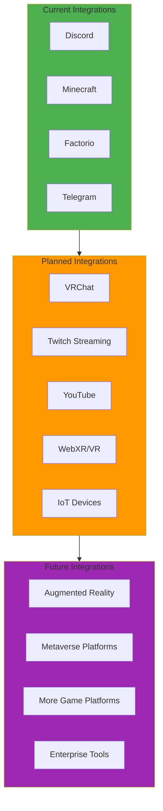

This integration architecture provides a robust, scalable foundation for AIRI's extensive external service interactions while maintaining security, reliability, and performance.