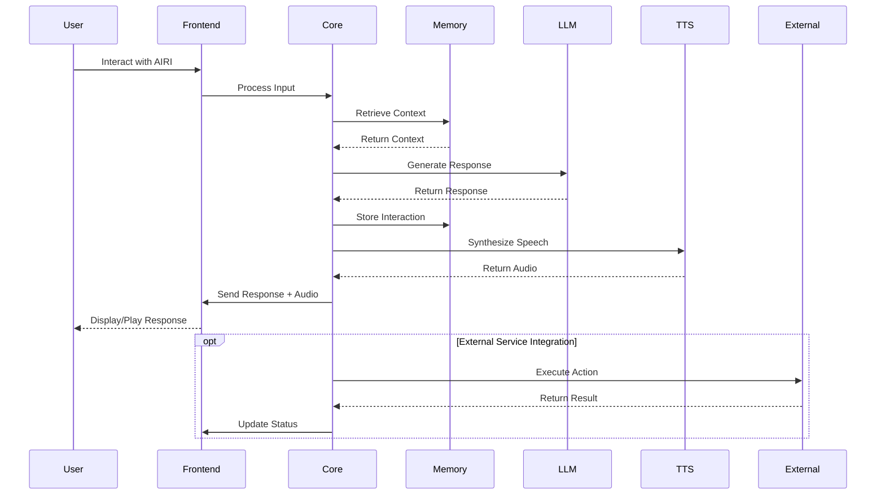

# System Overview

This document provides a high-level overview of Project AIRI's system architecture, including the main components and their interactions.

## High-Level Architecture

Project AIRI follows a layered architecture pattern with clear separation of concerns:

```mermaid
%%{ init: { 'flowchart': { 'curve': 'catmullRom' } } }%%

graph TB
    subgraph "Presentation Layer"
        A[Stage Web - Browser Interface]
        B[Stage Tamagotchi - Desktop App]
        C[Documentation Site]
        D[Admin Interfaces]
    end
    
    subgraph "Application Layer"
        E[AIRI Core Engine]
        F[Stage UI Components]
        G[Audio Processing Pipeline]
        H[Character Animation System]
    end
    
    subgraph "Service Layer"
        I[Discord Integration Service]
        J[Minecraft Game Service]
        K[Telegram Bot Service]
        L[Factorio Game Service]
        M[Twitter Service]
        N[LLM Provider Services]
    end
    
    subgraph "Infrastructure Layer"
        O[Memory Management]
        P[Database (DuckDB WASM)]
        Q[Vector Memory Store]
        R[Audio System]
        S[WebGPU Compute]
        T[File System]
    end
    
    subgraph "External Systems"
        U[LLM APIs<br/>(OpenAI, Anthropic, etc.)]
        V[Voice Services<br/>(ElevenLabs)]
        W[Game Servers<br/>(Minecraft, Factorio)]
        X[Social Platforms<br/>(Discord, Telegram)]
        Y[Model Repositories<br/>(HuggingFace)]
    end
    
    A --> E
    B --> E
    C --> F
    D --> E
    
    E --> G
    E --> H
    F --> G
    F --> H
    
    E --> I
    E --> J
    E --> K
    E --> L
    E --> M
    E --> N
    
    G --> R
    H --> S
    E --> O
    O --> P
    O --> Q
    E --> T
    
    N --> U
    G --> V
    J --> W
    L --> W
    I --> X
    K --> X
    M --> X
    H --> Y
    
    style E fill:#ff6b6b
    style "Presentation Layer" fill:#4ecdc4,color:#fff
    style "Application Layer" fill:#45b7d1,color:#fff
    style "Service Layer" fill:#f9ca24,color:#000
    style "Infrastructure Layer" fill:#6c5ce7,color:#fff
    style "External Systems" fill:#a0a0a0,color:#fff
```

## Core System Components

### 1. AIRI Core Engine
The central processing unit that orchestrates all system components:
- Manages character state and behavior
- Coordinates between different services
- Handles real-time decision making
- Manages conversation context and memory

### 2. Presentation Layer
Multiple frontend interfaces providing different user experiences:
- **Stage Web**: Browser-based interface using Vue.js and modern web technologies
- **Stage Tamagotchi**: Electron/Tauri-based desktop application
- **Documentation Site**: VitePress-based documentation and guides

### 3. Audio Processing System
Real-time audio pipeline for voice interaction:
- Speech recognition and voice activity detection
- Text-to-speech synthesis
- Audio streaming and real-time processing
- Support for multiple audio sources and outputs

### 4. Memory and Data Management
Sophisticated memory system for persistent character memory:
- Short-term conversational memory
- Long-term episodic memory
- Vector-based semantic memory
- Database operations with DuckDB WASM

### 5. Service Integration Layer
Modular services for external platform integration:
- Discord bot with voice channel support
- Minecraft gameplay automation
- Telegram messaging
- Factorio game automation
- Social media integrations

## System Flow Overview



## Key Architectural Patterns

### 1. Event-Driven Architecture
- Components communicate through events
- Loose coupling between modules
- Real-time reactive updates

### 2. Microservices Pattern
- Each service is independently deployable
- Clear service boundaries
- Fault isolation and resilience

### 3. Plugin Architecture
- Extensible through plugins
- Dynamic loading of capabilities
- Third-party integrations

### 4. Layered Architecture
- Clear separation of concerns
- Dependency management
- Testability and maintainability

## Technology Choices

### Frontend Technologies
- **Vue.js 3**: Reactive frontend framework
- **TypeScript**: Type-safe JavaScript
- **Vite**: Fast build tool and dev server
- **UnoCSS**: Atomic CSS framework

### Backend Technologies
- **Node.js**: Runtime environment
- **Tauri**: Desktop app framework (Rust)
- **WebAssembly**: High-performance computing
- **DuckDB**: Embedded analytics database

### AI/ML Technologies
- **xsAI**: Multi-provider LLM integration
- **Transformers.js**: Browser-based ML
- **ONNX Runtime**: Cross-platform ML inference
- **WebGPU**: GPU acceleration in browsers

### Infrastructure
- **pnpm**: Package management
- **Turbo**: Monorepo build system
- **Docker**: Containerization
- **GitHub Actions**: CI/CD

## Scalability Considerations

### Horizontal Scaling
- Stateless service design
- Load balancing capabilities
- Database sharding potential

### Vertical Scaling
- WebGPU for computational intensive tasks
- Memory optimization strategies
- Efficient resource utilization

### Performance Optimization
- Lazy loading of components
- Code splitting and bundling
- Caching strategies
- Real-time optimization

## Security Architecture

### Data Protection
- Encrypted storage for sensitive data
- Secure API key management
- Privacy-first design principles

### Access Control
- Role-based permissions
- API rate limiting
- Input validation and sanitization

### Network Security
- HTTPS/WSS encryption
- CORS policy configuration
- Content Security Policy

## Monitoring and Observability

### Logging
- Structured logging across all components
- Log aggregation and analysis
- Error tracking and reporting

### Metrics
- Performance monitoring
- Resource usage tracking
- User interaction analytics

### Health Checks
- Service availability monitoring
- Dependency health checks
- Automated alerting systems