# Technology Stack

This document provides a comprehensive overview of the technology stack used in Project AIRI, including programming languages, frameworks, libraries, and tools.

## Technology Stack Overview

Project AIRI leverages modern web technologies, AI/ML frameworks, and cutting-edge tools to create a sophisticated AI VTuber platform.

```mermaid
%%{ init: { 'flowchart': { 'curve': 'catmullRom' } } }%%

graph TB
    subgraph Frontend["Frontend Technologies"]
        Vue["Vue.js 3"]
        TypeScript["TypeScript"]
        Vite["Vite"]
        UnoCSS["UnoCSS"]
        WebGL["WebGL/WebGPU"]
        WebAudio["Web Audio API"]
    end
    
    subgraph Backend["Backend Technologies"]
        NodeJS["Node.js"]
        Rust["Rust"]
        Tauri["Tauri"]
        WASM["WebAssembly"]
        Workers["Web Workers"]
    end
    
    subgraph Database["Database Technologies"]
        DuckDB["DuckDB WASM"]
        SQLite["SQLite"]
        IndexedDB["IndexedDB"]
        VectorDB["Vector Database"]
    end
    
    subgraph AI_ML["AI/ML Technologies"]
        Transformers["Transformers.js"]
        ONNX["ONNX Runtime"]
        Candle["Candle (Rust)"]
        WebGPU_ML["WebGPU ML"]
        xsAI["xsAI Library"]
    end
    
    subgraph DevTools["Development Tools"]
        PNPM["pnpm"]
        Turbo["Turborepo"]
        ESLint["ESLint"]
        Vitest["Vitest"]
        GitHub["GitHub Actions"]
    end
    
    Frontend --> Backend
    Backend --> Database
    Database --> AI_ML
    AI_ML --> DevTools
    
    style Frontend fill:#42b883
    style Backend fill:#f68d2e
    style Database fill:#336791
    style AI_ML fill:#ff6b6b
    style DevTools fill:#6c5ce7
```

## Programming Languages

### TypeScript/JavaScript
Primary language for frontend and backend development.

**Usage**:
- Frontend applications (Vue.js components)
- Backend services and APIs
- Build tools and scripts
- Testing frameworks

**Version**: TypeScript 5.9.2, ESNext targets

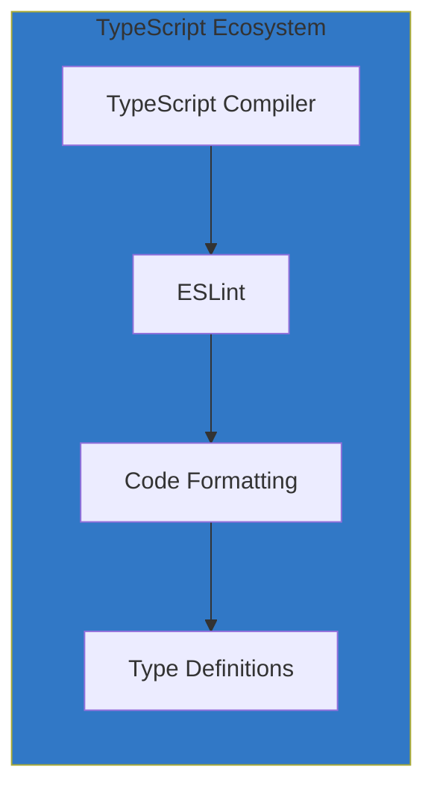

### Rust
Systems programming language for performance-critical components and desktop application backend.

**Usage**:
- Tauri desktop application backend
- Custom Tauri plugins
- WebAssembly modules
- Performance-critical algorithms
- Native integrations

**Key Crates Used**:
- `tauri`: Desktop app framework
- `tokio`: Async runtime
- `serde`: Serialization
- `candle`: ML inference
- `rdev`: Input monitoring

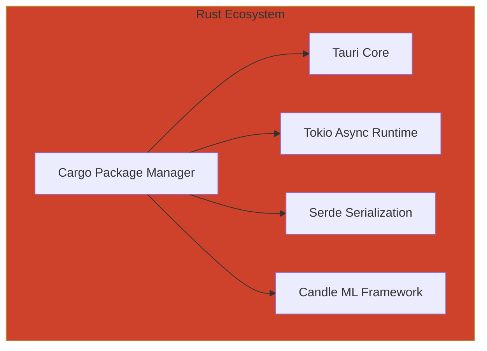

## Frontend Technologies

### Vue.js 3
Progressive JavaScript framework for building user interfaces.

**Key Features Used**:
- Composition API
- Reactive system
- Single File Components (SFC)
- Teleport and Suspense
- Custom directives

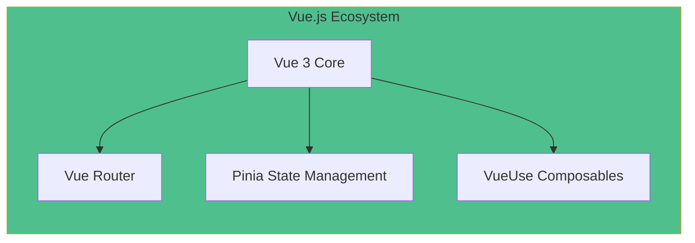

**Vue Components Architecture**:
```typescript
// Example component structure
interface ComponentStructure {
  setup(): CompositionAPI;
  template: HTMLTemplate;
  style: ScopedCSS;
  props: TypedProps;
  emits: TypedEmits;
}
```

### Build Tools

#### Vite
Fast build tool and development server.

**Configuration**:
- Hot Module Replacement (HMR)
- Plugin ecosystem
- Optimized production builds
- Asset processing

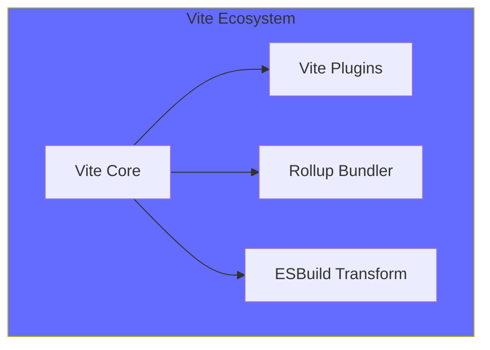

#### UnoCSS
Instant on-demand atomic CSS engine.

**Features**:
- Atomic CSS utilities
- Custom presets and rules
- Just-in-time generation
- Framework agnostic

### WebGL/WebGPU
Graphics and compute APIs for browser-based rendering and AI acceleration.

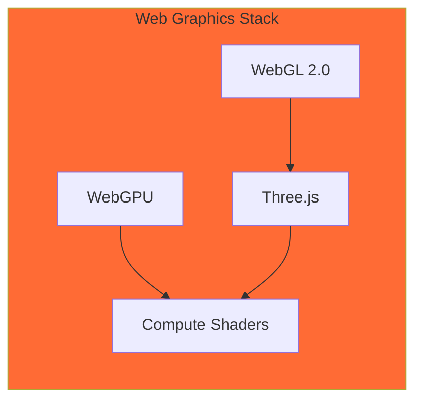

**Use Cases**:
- 3D character rendering (VRM/Live2D)
- Real-time graphics effects
- GPU-accelerated AI inference
- Particle systems and animations

## Backend Technologies

### Node.js Runtime
JavaScript runtime built on Chrome's V8 engine.

**Key Features**:
- Asynchronous I/O
- NPM ecosystem
- Cross-platform support
- Performance optimization

### Tauri Framework
Desktop application framework combining Rust backend with web frontend.

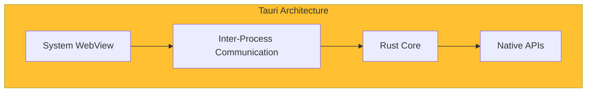

**Benefits**:
- Small bundle size
- Native performance
- Security by default
- Cross-platform compatibility

### WebAssembly (WASM)
Binary instruction format for high-performance web applications.

**Use Cases**:
- DuckDB database engine
- Image/audio processing
- Cryptographic operations
- ML model inference

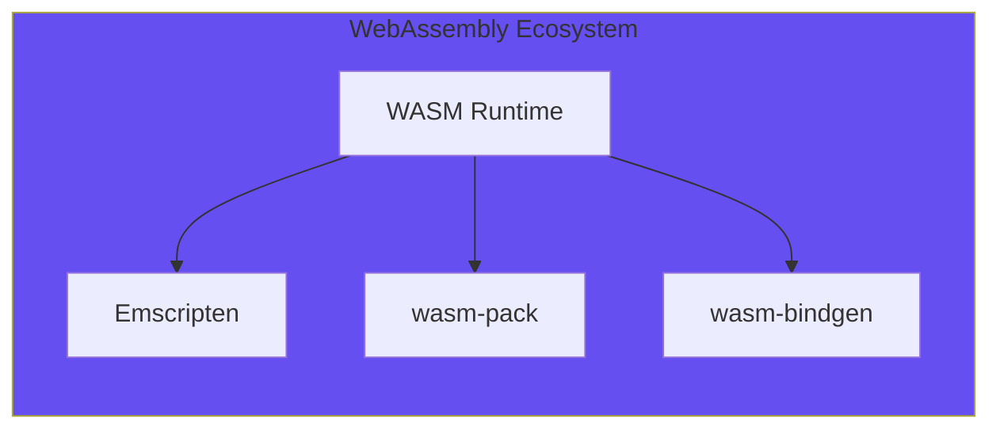

## Database Technologies

### DuckDB WASM
High-performance analytical database running in WebAssembly.

**Features**:
- SQL analytics in the browser
- Columnar storage
- Vectorized query execution
- Zero-config embedded database

```sql
-- Example DuckDB usage
CREATE TABLE conversations (
    id VARCHAR PRIMARY KEY,
    content TEXT,
    embeddings FLOAT[],
    created_at TIMESTAMP
);

SELECT * FROM conversations 
WHERE array_cosine_similarity(embeddings, $1) > 0.8
ORDER BY created_at DESC;
```

### Drizzle ORM
Type-safe ORM for database operations.

```typescript
// Example schema definition
export const conversations = sqliteTable('conversations', {
  id: text('id').primaryKey(),
  content: text('content').notNull(),
  embeddings: text('embeddings', { mode: 'json' }).$type<number[]>(),
  createdAt: integer('created_at', { mode: 'timestamp' })
});
```

### Vector Database
Custom vector storage implementation for semantic search.

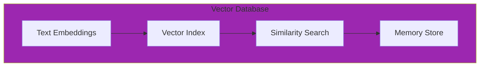

## AI/ML Technologies

### xsAI Library
Unified library for integrating multiple LLM providers.

**Supported Providers** (40+):
- OpenAI, Anthropic, Google
- Local models (Ollama, vLLM)
- Cloud providers (Groq, Together.ai)
- Regional providers (Qwen, Zhipu)

```typescript
// xsAI usage example
import { createOpenAI } from 'xsai'

const ai = createOpenAI({
  apiKey: process.env.OPENAI_API_KEY,
  baseURL: 'https://api.openai.com/v1'
})

const response = await ai.chat.completions.create({
  model: 'gpt-4',
  messages: [{ role: 'user', content: 'Hello!' }]
})
```

### Transformers.js
JavaScript library for running pre-trained models in the browser.

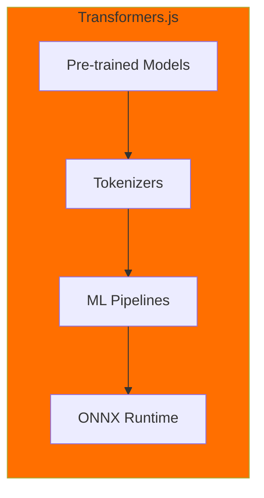

### ONNX Runtime
Cross-platform ML inference runtime.

**Use Cases**:
- Speech recognition models
- Voice activity detection
- Text embeddings
- Audio processing models

### Candle (Rust ML Framework)
Rust-based ML framework for desktop applications.

**Features**:
- CUDA and Metal support
- Efficient tensor operations
- Model loading and inference
- Integration with Tauri

## Development Tools

### Package Management

#### pnpm
Fast, disk space efficient package manager.

**Features**:
- Shared dependency storage
- Strict dependency resolution
- Workspace support
- Performance optimization

```yaml
# pnpm-workspace.yaml
packages:
  - 'packages/**'
  - 'apps/**'
  - 'services/**'
  - 'plugins/**'
```

#### Turborepo
High-performance build system for JavaScript/TypeScript monorepos.

```json
{
  "pipeline": {
    "build": {
      "dependsOn": ["^build"],
      "outputs": ["dist/**"]
    },
    "test": {
      "dependsOn": ["build"]
    }
  }
}
```

### Code Quality

#### ESLint
JavaScript and TypeScript linter with custom configuration.

```typescript
// eslint.config.ts
export default [
  {
    files: ['**/*.{js,ts,vue}'],
    rules: {
      '@typescript-eslint/no-unused-vars': 'error',
      'vue/multi-word-component-names': 'warn'
    }
  }
]
```

#### Vitest
Fast unit test framework built on Vite.

```typescript
// Example test
import { describe, it, expect } from 'vitest'
import { mount } from '@vue/test-utils'
import Component from './Component.vue'

describe('Component', () => {
  it('renders properly', () => {
    const wrapper = mount(Component)
    expect(wrapper.text()).toContain('Hello')
  })
})
```

### CI/CD Pipeline

#### GitHub Actions
Automated workflows for testing, building, and deployment.

```yaml
# .github/workflows/ci.yml
name: CI
on: [push, pull_request]
jobs:
  test:
    runs-on: ubuntu-latest
    steps:
      - uses: actions/checkout@v4
      - uses: pnpm/action-setup@v4
      - run: pnpm install
      - run: pnpm test
      - run: pnpm build
```

## Deployment Technologies

### Docker
Containerization platform for consistent deployments.

```dockerfile
FROM node:20-alpine
WORKDIR /app
COPY package*.json ./
RUN pnpm install
COPY . .
RUN pnpm build
EXPOSE 3000
CMD ["pnpm", "start"]
```

### Nix
Reproducible package management and deployment.

```nix
{
  description = "AIRI development environment";
  
  inputs = {
    nixpkgs.url = "github:NixOS/nixpkgs/nixos-unstable";
  };
  
  outputs = { self, nixpkgs }: {
    devShells.default = pkgs.mkShell {
      packages = [ pkgs.nodejs pkgs.pnpm pkgs.rust-bin ];
    };
  };
}
```

## Performance Technologies

### Web Workers
Background JavaScript execution for CPU-intensive tasks.

```typescript
// worker.ts
self.onmessage = async (event) => {
  const { audio, model } = event.data
  const result = await processAudio(audio, model)
  self.postMessage(result)
}
```

### WebGPU Compute
GPU acceleration for ML inference and audio processing.

```javascript
// WebGPU compute shader
const computeShader = `
@compute @workgroup_size(256)
fn main(@builtin(global_invocation_id) global_id: vec3<u32>) {
  let index = global_id.x;
  output[index] = input[index] * weight[index];
}
`;
```

## Monitoring and Analytics

### Error Tracking
- Console error monitoring
- Performance metrics collection
- User interaction analytics
- Health check systems

### Performance Monitoring

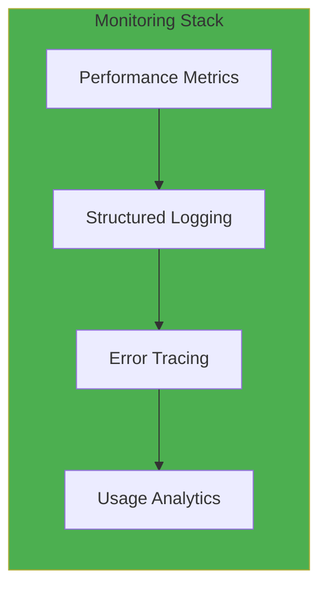

## Technology Selection Rationale

### Frontend Choices
- **Vue.js 3**: Gentle learning curve, excellent performance, strong TypeScript support
- **TypeScript**: Type safety, better IDE support, reduced runtime errors
- **Vite**: Fast development experience, optimized builds
- **UnoCSS**: Atomic CSS for maintainable styling

### Backend Choices
- **Rust**: Memory safety, performance, excellent WebAssembly support
- **Tauri**: Smaller bundle size than Electron, better security model
- **Node.js**: Large ecosystem, JavaScript consistency

### Database Choices
- **DuckDB WASM**: High-performance analytics, browser compatibility
- **Vector Database**: Semantic search capabilities for AI memory

### AI/ML Choices
- **xsAI**: Provider flexibility, unified API
- **Transformers.js**: Browser-based ML, privacy-first approach
- **ONNX Runtime**: Cross-platform compatibility, performance

This technology stack provides a modern, performant, and scalable foundation for AIRI's sophisticated AI VTuber platform while maintaining excellent developer experience and user performance.